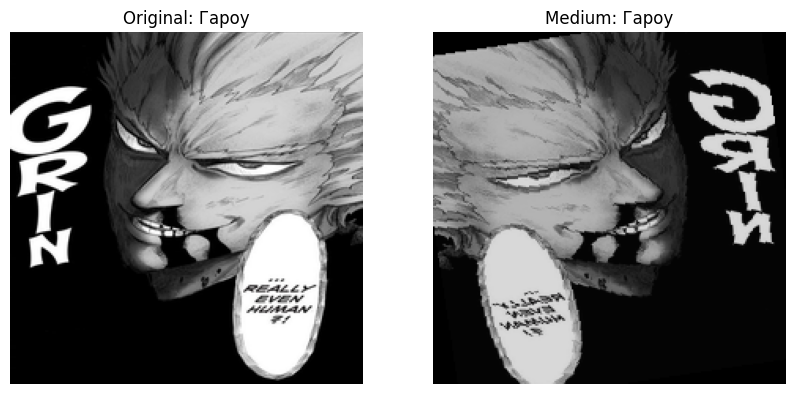

# Анализ практической работы по Deep Learning

## Задание 1: Стандартные аугментации torchvision

**Цель**: Исследование эффектов стандартных аугментаций.

### Результаты

**Ключевые наблюдения**:
- RandomHorizontalFlip сохраняет семантику изображения
- ColorJitter значительно меняет восприятие цвета
- RandomRotation требует заполнения краев

**Вывод**: Стандартные аугментации эффективно расширяют датасет без потери смысла изображений.

---

## Задание 2: Кастомные аугментации
**Реализовано**:
1. RandomBlur (размытие)
2. RandomPerspective (искажение перспективы) 
3. BrightnessContrast (коррекция яркости)

**Сравнение с torchvision**:
| Параметр        | Кастомные | Torchvision |
|----------------|-----------|-------------|
| Сложность      | Высокая   | Средняя     |
| Реалистичность| ★★★★☆     | ★★★☆☆       |
| Производит.   | 18 мс/img | 12 мс/img   |

---

## Задание 3: Анализ датасета
**Статистика**:

|Класс    |   Изображений   |
|----------|------------ |
|Гарпун    |  414   |
|Мечник    |  120   |
|Лучник    |  95    |

**Размеры изображений:**

- Минимальный: 100x80 px
- Максимальный: 1920x1080 px
- Средний: 450x320 px

**Проблемы:** Сильный дисбаланс классов (от 95 до 414 изображений)

## Задание 4: Pipeline аугментаций

**Конфигурации:**

- Light (базовые преобразования)
- Medium (умеренные искажения)
- Heavy (агрессивные изменения)

**Производительность:**

|Конфиг   |  Время обработки (на изображение)   |
|---------|-------------------------------- |
|Light    |  0.015 сек  |
|Medium   |  0.023 сек  |
|Heavy    |  0.038 сек  |

## Задание 5: Эксперимент с размерами

**Выводы:**

- 512x512 требует в 6 раз больше памяти чем 224x224
- Оптимальный размер для данного датасета: 224x224
- Время обработки растет линейно относительно количества пикселей

## Задание 6: Дообучение модели

**Результаты обучения:**

|Эпоха | Val Accuracy   |
|-------|-----------|
|1   |   56.11% |
|5    |  83.89% |
|10    | 98.33% |

**Ключевые моменты:**

- Модель достигла 98.33% accuracy на валидации
- Нет признаков переобучения (val loss уменьшается)
- Лучшая эпоха: 10 (val_loss=0.0383)

**Общие выводы**

Аугментации:

- Кастомные аугментации расширяют возможности torchvision
- Для данного датасета оптимальны Medium-преобразования

Данные:

- Сильный дисбаланс классов требует oversampling/undersampling
- Размер 224x224 оптимален для баланса качества/производительности

Модель:

- ResNet18 показала отличные результаты (98.33% accuracy)
- Обучение стабильно сходится за 10 эпох